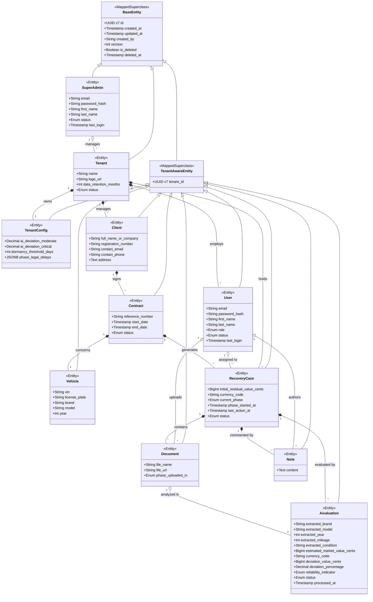

# Class Diagram — LeasRecover

**Date:** 2026-03-25
**Author:** Winston (Architect)
**Reflects:** Object-Oriented Implementation of `mcd.md`

This document contains the UML Class Diagram for the LeasRecover platform, mapped to our object-oriented architecture. It correctly surfaces the `@MappedSuperclass` hierarchy (`BaseEntity` and `TenantAwareEntity`) which translates directly into our Java/Hibernate implementation, keeping our domain model DRY and strictly typed.

