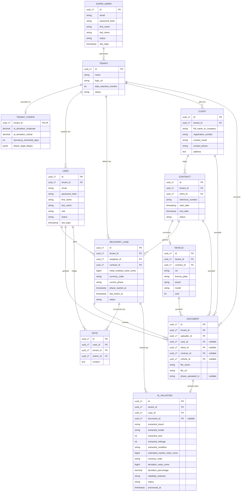

# Modèle Conceptuel de Données (MCD) — LeasRecover

**Date:** 2026-03-16
**Auteur:** IlhemBENYEDDER
**Statut:** MVP Version 1.0

Ce document détaille le Modèle Conceptuel de Données (MCD) pour la plateforme SaaS B2B LeasRecover, basé sur les exigences définies dans le PRD. Il respecte rigoureusement le principe **DRY (Don't Repeat Yourself)** en introduisant une architecture d'héritage d'entités de base (Base Entities) pour factoriser les propriétés communes comme les identifiants, la traçabilité d'audit et l'isolation Multi-Tenant.

L'architecture des données répond également aux plus hauts standards de performance, de conformité et de résilience, notamment via l'utilisation d'UUID v7, de types monétaires stricts, du Soft Delete et de JSONB.

---

## 1. Modèle d'Héritage (Base Entities)

Pour éviter la redondance et garantir que toutes les tables respectent la conformité d'audit et l'isolation des données, toutes les entités du domaine métier héritent des classes de base suivantes :

### **1.1. BaseEntity**
La classe racine fondamentale de l'application :
- `id` (UUID v7) : Clé Primaire universelle temporelle. Les **UUID v7** (supportés nativement) garantissent une indexation B-Tree optimale en base de données car ils sont générés séquentiellement dans le temps.
- `created_at` (Timestamp) : Date de création (Audit).
- `updated_at` (Timestamp) : Date de dernière modification (Audit).
- `created_by` (String/UUID v7) : Référence de l'utilisateur ayant créé l'enregistrement.
- `version` (Int) : Utilisé pour le *Optimistic Locking* (JPA `@Version`) afin de prévenir les conflits de modification simultanés.
- `is_deleted` (Boolean) : Flag pour la **Suppression Logique (Soft Delete)**. Valeur par défaut `false`. Activé via l'annotation Hibernate `@SQLDelete` et filtré globalement via `@Where(clause = "is_deleted = false")`.
- `deleted_at` (Timestamp) : Horodatage de la suppression logique (null par défaut).

### **1.2. TenantAwareEntity (Extends BaseEntity)**
Héritage spécifique pour l'architecture SaaS Multi-Tenant. Toutes les entités appartenant à un client logiciel (Tenant) héritent de cette classe.
- `tenant_id` (UUID v7) : Clé étrangère vers la racine `TENANT`. Obligatoire pour le filtrage Global (ex: `@TenantId` en Hibernate).

> *Note : Dans la description des entités ci-dessous, les champs hérités (`id`, `created_at`, `updated_at`, `is_deleted`, `tenant_id`, etc.) ne sont pas répétés.*

---

## 2. Vue d'ensemble (Entity-Relationship Diagram)

> **Clarification technique (Objet vs Physique) :**
> Le diagramme Mermaid ci-dessous représente la **modélisation physique (Modèle Relationnel de la Base de Données)**. En base de données SQL, l'héritage d'objet n'existe pas nativement.
> C'est pourquoi `BaseEntity` et `TenantAwareEntity` n'apparaissent pas comme des entités/tables distinctes. Afin de faire le pont entre notre code Java orienté objet (Section 1) et le schéma SQL final, l'ORM (Hibernate) utilisera la stratégie **`@MappedSuperclass`**. Grâce à cette annotation, tous les champs des classes de base (`id`, `created_at`, `version`, `tenant_id`, etc.) seront **physiquement "aplatis" (flattened)** puis injectés à l'intérieur même des tables enfants (comme `recovery_case` et `user`) au moment de la création du schéma.
> Le diagramme Mermaid affiche donc sciemment ces clés `id` et `tenant_id` à l'intérieur des entités finales pour garantir une lisibilité parfaite des jointures et des relations SQL, reflétant ce qui existera physiquement en production.

De plus, l'entité transactionnelle d'audit `ACTION_HISTORY` n'apparaît plus, étant désormais prise en charge implicitement par les tables miroirs d'**Hibernate Envers** (ex: `RECOVERY_CASE_AUD`).

---

## 3. Description Spécifique des Entités Métier

### 3.1. Entités Globales & Configuration

#### **TENANT (Société de Leasing)**
*Hérite de: `BaseEntity`*
Entité racine qui isole les données par client SaaS.
- `name` (String) : Nom de la société de leasing (ex: MediLease SA).
- `logo_url` (String) : Identité visuelle.
- `data_retention_months` (Int) : Durée de conservation légale des données (Conformité RGPD/Loi 63-2004).
- `status` (Enum) : `ACTIVE`, `INACTIVE`.

#### **TENANT_CONFIG (Configuration du Tenant)**
*Relation 1:1 avec `TENANT`. Utilise `tenant_id` comme PK.*
- `ai_deviation_moderate` (Decimal) : Seuil d'alerte (ex: 10.00).
- `ai_deviation_critical` (Decimal) : Seuil de risque élevé (ex: 20.00).
- `dormancy_threshold_days` (Int) : Tolérance d'inactivité avant alerte (ex: 5 jours).
- `phase_legal_delays` (JSONB) : Stocke les délais maximum par phase légale de manière indexable. (ex: `{"MISE_EN_DEMEURE": 15, "SAISIE": 30}`).

#### **SUPER_ADMIN (Administrateur Plateforme)**
*Hérite de: `BaseEntity`*
- `email`, `password_hash`, `first_name`, `last_name` : Identité du super administrateur global.
- `status` (Enum) : `ACTIVE`, `SUSPENDED`.
- `last_login` (Timestamp) : Sécurité et suivi de session.

#### **USER (Utilisateur Locataire)**
*Hérite de: `TenantAwareEntity`*
- `email`, `password_hash`, `first_name`, `last_name` : Identité de l'utilisateur.
- `role` (Enum) : `ADMIN` (Administrateur du tenant), `GESTIONNAIRE` (Opérationnel).
- `status` (Enum) : `ACTIVE`, `SUSPENDED`.
- `last_login` (Timestamp) : Sécurité et suivi de session.

---

### 3.2. Cœur Métier (Entités Principales & Workflow)

#### **CLIENT (Client / Débiteur)**
*Hérite de: `TenantAwareEntity`. Entity annotée `@Audited`.*
- `full_name_or_company` (String) : Nom complet ou raison sociale.
- `registration_number` (String) : CIN, SIRET ou équivalent.
- `contact_email` / `contact_phone` (String) : Coordonnées principales.
- `address` (Text) : Adresse physique de facturation/localisation.

#### **CONTRACT (Contrat de Leasing)**
*Hérite de: `TenantAwareEntity`. Entity annotée `@Audited`.*
- `client_id` (UUID v7) : FK vers le client preneur du leasing.
- `reference_number` (String) : Numéro unique du contrat de leasing.
- `start_date` / `end_date` (Timestamp) : Période du contrat de leasing.
- `status` (Enum) : État du contrat (ex: `ACTIVE`, `DEFAULTED`, `TERMINATED`).

#### **VEHICLE (Véhicule / Actif loué)**
*Hérite de: `TenantAwareEntity`. Entity annotée `@Audited`.*
- `contract_id` (UUID v7) : FK vers le contrat le liant.
- `vin` (String) : Numéro de châssis unique (Vehicle Identification Number).
- `license_plate` (String) : Plaque d'immatriculation.
- `brand`, `model`, `year` (String/Int) : Informations descriptives du véhicule en leasing.

#### **RECOVERY_CASE (Dossier de Recouvrement)**
*Hérite de: `TenantAwareEntity`. Entity annotée `@Audited` (Hibernate Envers).*
- `assignee_id` (UUID v7) : FK vers `USER` (Le Gestionnaire responsable direct).
- `contract_id` (UUID v7) : FK vers le contrat en défaut `CONTRACT` (permettant la résolution Client et Véhicule).
- **Variables Financières strictes** :
  - `initial_residual_value_cents` (BigInt) : Valeur financière du matériel au contrat stockée en centimes (ex: 2500000 = 25 000.00) pour éviter les erreurs d'arrondi en virgule flottante.
  - `currency_code` (String, max=3) : Code devise ISO 4217, (ex: `TND`, `EUR`). Défaut: configuré par le locataire.
- `current_phase` (Enum) : `PRE_CONTENTIEUX`, `MISE_EN_DEMEURE`, `SAISIE`, `VENTE`, `CLOTURE`.
- `phase_started_at` (Timestamp) : Décompte des délais légaux.
- `last_action_at` (Timestamp) : Cache dénormalisé pour détecter rapidement la dormance sans requêter Envers.
- `status` (Enum) : `ACTIVE`, `CLOSED`, `CANCELLED`.

#### **DOCUMENT (Pièce Jointe / Rapport d'Expertise / Documents Administratifs)**
*Hérite de: `TenantAwareEntity`. Entity annotée `@Audited`.*
- **Liaisons Polymorphiques (FKs nullables)** :
  - `case_id` (UUID v7) : Document lié spécifiquement au parcours de recouvrement.
  - `client_id` (UUID v7) : Document d'identité, Kbis du débiteur, etc.
  - `contract_id` (UUID v7) : Copie du document contractuel, échéancier.
  - `vehicle_id` (UUID v7) : Carte grise, historique d'entretien indépendant du recouvrement.
- `uploader_id` (UUID v7) : FK vers le `USER`.
- `file_name` (String) : Nom d'origine du fichier.
- `file_url` (String) : Pointeur d'accès sécurisé vers le stockage blob.
- `phase_uploaded_in` (Enum) : Tag indiquant à quelle étape le document est rattaché (seulement si lié à un Case).

#### **NOTE (Commentaire)**
*Hérite de: `TenantAwareEntity`. Entity annotée `@Audited`.*
- `case_id` (UUID v7) : FK vers le dossier.
- `author_id` (UUID v7) : FK vers le créateur du commentaire (lié à `USER`).
- `content` (Text) : Message libre du gestionnaire (Annotation manuelle).

---

### 3.3. Module d'Intelligence Artificielle

#### **AI_VALUATION (Estimation IA LLM/NLP)**
*Hérite de: `TenantAwareEntity`. Entity annotée `@Audited`.*
- `case_id` (UUID v7) : FK liant l'IA au dossier physique.
- `document_id` (UUID v7) : FK pointant vers la source analysée.
- **Extraction Brute** : `extracted_brand`, `extracted_model`, `extracted_year`, `extracted_mileage`, `extracted_condition`.
- **Variables Financières strictes** :
  - `estimated_market_value_cents` (BigInt) : Valeur pécuniaire calculée après OCR en centimes.
  - `deviation_value_cents` (BigInt) : Écart chiffré en centimes (`estimated_market_value_cents` - `initial_residual_value_cents`).
  - `currency_code` (String) : Code devise (ex: `TND`).
- `deviation_percentage` (Decimal) : Taux de variation en %.
- `reliability_indicator` (Enum) : `RELIABLE`, `MODERATE_DEVIATION`, `CRITICAL_DEVIATION`.
- `status` (Enum) : État du traitement asynchrone pour la webhook (`PENDING`, `SUCCESS`, `FAILED`).
- `processed_at` (Timestamp) : Horodatage d'achèvement par le microservice Python.

---

### 3.4. Traçabilité (Audit Trail Automatisé)

L'ancienne entité transactionnelle `ACTION_HISTORY` a été retirée du MCD au profit d'une **automatisation d'Audit Trail via Hibernate Envers**.  
Toute entité précédée de l'annotation `@Audited` dans le code Java déclenche automatiquement la création (et la gestion) par l'ORM de tables miroirs de versionnage (suffixées `_AUD`). 

Lorsqu'un utilisateur modifie la phase d'un `RECOVERY_CASE`, Envers crée dans `RECOVERY_CASE_AUD` une entrée avec :
- L'historique des valeurs exactes avant et après (`payload`).
- La liaison sémantique vers l'acteur (`created_by` dans la table transactionnelle, couplé à la Revision Entity personnalisée d'Envers).
- Le type de révision (`ADD`, `MOD`, `DEL`).
Cela garantit une historique à 100% conforme sans aucune intervention ni maintenance dans le code métier, excluant toute violation de l'audit.

---

## 4. Contraintes Intégrées et Performances Optimisées

1. **UUID v7 (Performance Database) :** Tout identifiant primaire emploie le format UUID v7. Sa génération incluant l'horodatage Linux le rend sémantiquement *triable* (sortable), ce qui élimine la fragmentation des index B-Tree (bloat) provoquée par l’aléatoire des UUID v4.
2. **Types JSONB (Indexation native) :** L'usage de `JSONB` au lieu du JSON texte classique permet à PostgreSQL de parser l'objet documentaire dès sa création et de créer des index GIN performants sur ses clés. Requêter sur les délais légaux de `TENANT_CONFIG` est instantané.
3. **Monétaires BigInt (Précision Absolue) :** L'estimation IA et la valeur résiduelle du dossier sont stockées par le type BigInt représentant le plus petit dénominateur (ex: les centimes). C'est la seule approche architecturale qui bannit mathématiquement les erreurs d'arrondi (floating point math errors), en tandem avec le code `currency_code` pour le typage métier fort.
4. **Soft Delete & Conformité Légale :** Les entités modifiées via le boolean global `is_deleted` et le `deleted_at` hérités de BaseEntity évitent la destruction des Foreign Keys. Cela résout la problématique de la RGPD et de l'opposabilité juridique tout en isolant visuellement ce qui doit l'être.
5. **JPA & Tenant Filtering :** (Principe DRY conservé). Interception Hibernate automatique du `@TenantId` pour l'isolation inaltérable SaaS.
