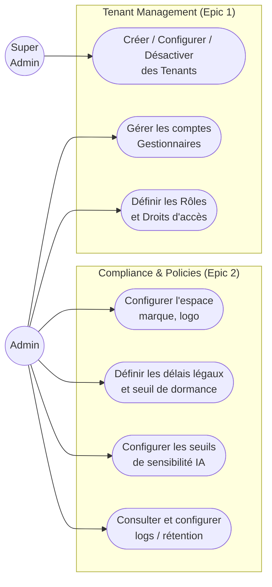
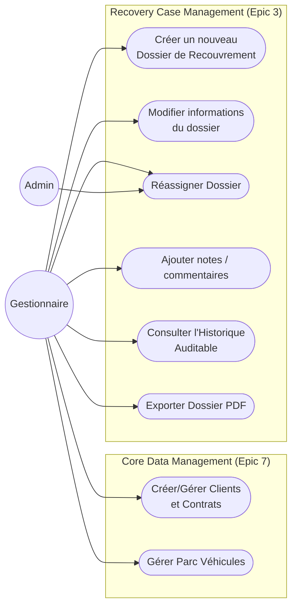
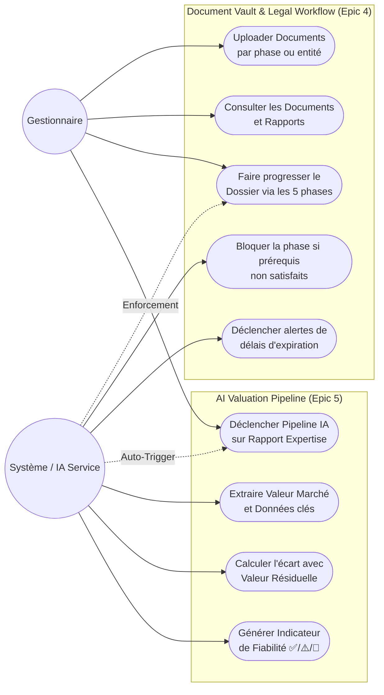
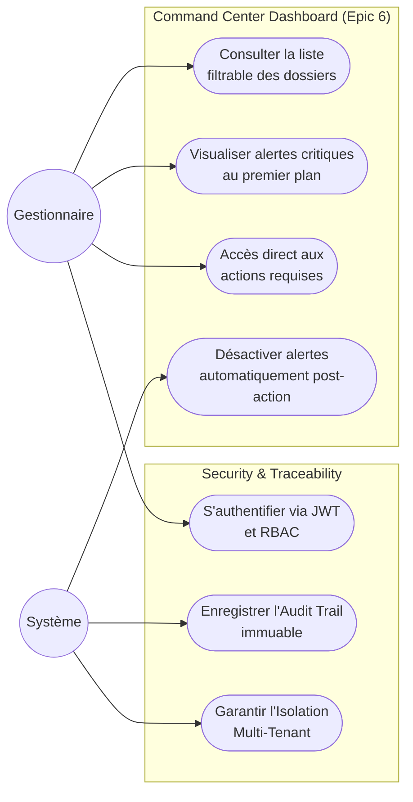

# LeasRecover - Use Case Diagrams

This document contains visual Use Case representations of the functional requirements found in the LeasRecover platform, modeled using Mermaid flowcharts. The actors include Super Admin, Admin, Gestionnaire, and the System itself.

## 1. Tenant & System Configuration (Administration)

This diagram covers the setup of the application environment by the Super Admin, as well as the initial configuration and compliance policies set by the company's Admin.

## 2. Core Entities & Case Management

This module details how Gestionnaires interact with Clients, Contracts, Vehicles, and the core Recovery Cases. Admins can also intervene for reassignment.

## 3. Workflow Progression, Documents & AI Valuation

This diagram illustrates the daily pipeline tasks. Gestionnaires navigate the 5 phases, while the System dynamically enforces checks, tracks inactivity, and performs AI data extraction.

## 4. Command Center Dashboard & Traceability

Focusing on the operational view where Gestionnaires handle their prioritized cases based on system alert feeds.

