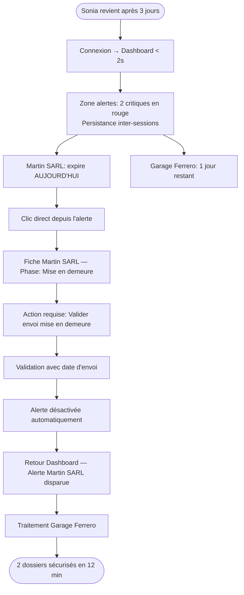
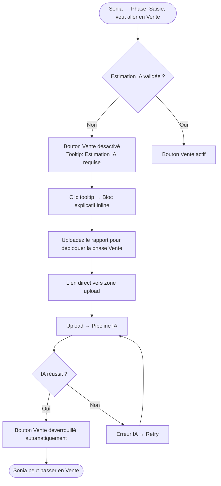

# UX Design Specification pfe

**Author:** IlhemBENYEDDER
**Date:** 2026-03-08

---

<!-- UX design content will be appended sequentially through collaborative workflow steps -->

## Executive Summary

### Project Vision

LeasRecover est une plateforme SaaS B2B multi-tenant destinée aux sociétés de leasing qui digitalise intégralement le workflow de recouvrement — de la phase pré-contentieuse à la clôture du dossier. Son différenciateur central est un module IA (LLM/NLP) qui analyse les rapports d'expertise véhicule uploadés, extrait les données clés, et affiche instantanément une comparaison valeur résiduelle vs. valeur de marché accompagnée d'un indicateur de fiabilité financière (✅/⚠️/🚨). La plateforme remplace les fichiers Excel et les documents papier par un système unifié, traçable, conforme légalement et paramétrable par société.

Le "moment aha!" est immédiat et mesurable : le gestionnaire uploade un rapport d'expertise, et en moins de 30 secondes la plateforme affiche côte à côte **valeur de marché estimée | valeur résiduelle initiale | écart en % et en valeur absolue** — une synthèse décisionnelle qui prenait auparavant 30 à 60 minutes de travail manuel.

### Target Users

| Utilisateur | Profil | Objectif principal |
|---|---|---|
| **Sonia** — Gestionnaire de Recouvrement | 34 ans, 30 à 60 dossiers actifs simultanés, à l'aise avec le numérique | Gérer les dossiers, ne rater aucun délai légal, obtenir l'estimation IA instantanément |
| **Karim** — Admin Société | Profil technique ou responsable IT, premier utilisateur avant les gestionnaires | Configurer la plateforme en autonomie totale (seuils, délais, utilisateurs, branding) |
| **Module IA** — Acteur système | Pipeline LLM/NLP non-humain | Traiter automatiquement les rapports uploadés → extraction → comparaison → indicateur |

**Utilisateurs secondaires (V2) :** Expert véhicule (upload direct), Intervenant juridique (consultation sécurisée), Manager (supervision read-only).

**Contexte d'utilisation :** Interface web desktop-first (SPA responsive), fonctionnelle sur tablette. Utilisée principalement en bureau, en journée de travail. Charge individuelle : 40 à 80 dossiers actifs par gestionnaire.

### Key Design Challenges

1. **La boucle Alerte-Action** — Le dashboard doit communiquer la hiérarchie d'urgence (critique / dormant / normal) d'un seul coup d'œil et permettre l'action en un minimum de clics. Sonia gère 30 à 60 dossiers en parallèle ; la surcharge cognitive est un risque réel à adresser par le design.

2. **Le moment de révélation du résultat IA** — C'est le "aha! moment" de LeasRecover. L'affichage de `valeur marché | valeur résiduelle | écart %` après upload doit être instantané, visuellement percutant et émotionnellement satisfaisant. L'état d'erreur (échec IA → retry) doit être gracieux et ne jamais bloquer l'utilisateur sans chemin de sortie clair.

3. **Les transitions de phase conditionnelles avec blocage** — Certaines progressions sont conditionnelles (ex. : pas de phase Vente sans estimation IA validée). Le UX doit rendre absolument explicite *pourquoi* une transition est bloquée et *exactement quelle action* l'utilisateur doit effectuer pour débloquer — sans frustration ni confusion.

4. **La complexité de configuration Admin vs. l'autonomie requise** — L'Admin doit configurer délais légaux, seuils d'alerte, utilisateurs et branding sans aucune assistance technique. Le UX admin doit être structuré comme un assistant de configuration guidé, pas un écran de paramètres brut.

### Design Opportunities

1. **La Carte de Comparaison de Valeur (signature UI)** — Concevoir un composant UI signature pour le résultat IA : une carte compacte et visuellement riche qui rend l'écart résiduel vs. marché immédiatement lisible (code couleur, valeur absolue et %). Ce composant devient l'élément iconique et mémorable du produit.

2. **Le Dashboard comme Centre de Commandement** — Le dashboard n'est pas une simple liste de dossiers — c'est le centre nerveux opérationnel du gestionnaire. Le concevoir comme un vrai tableau de bord prioritaire (et non une table générique) le différencie structurellement des ERP et CRM adaptés qui dominent le marché.

3. **Les Signaux de Confiance par le Design** — La plateforme remplace des processus juridiques sur papier. Chaque action doit sembler *officielle*, *traçable* et *fiable*. La typographie, les couleurs institutionnelles, l'espacement et les patterns de confirmation doivent transmettre une confiance de niveau professionnel.

---

## Core User Experience

### Defining Experience

L'interaction centrale de LeasRecover est la **boucle upload-to-reveal** : le gestionnaire uploade un rapport d'expertise véhicule, attend moins de 30 secondes avec un retour de progression visible, puis voit apparaître la **carte de comparaison de valeur** — l'écran le plus important du produit. C'est le moment qui définit la proposition de valeur de LeasRecover et sur lequel repose tout le reste de l'expérience.

La boucle opérationnelle principale de Sonia est : **Ouvrir le dashboard → identifier le dossier prioritaire → agir (transition de phase / upload / note)**. Cette boucle doit être fluide, sans friction, et répétable des dizaines de fois par semaine.

### Platform Strategy

- **Plateforme :** Application web SPA (Single Page Application) — desktop-first, fonctionnelle sur tablette
- **Interaction primaire :** Souris + clavier — aucune exigence tactile ou mobile pour le MVP
- **Offline :** Non requis — connexion réseau supposée en bureau
- **Capacités device spécifiques :** Aucune (pas de caméra, GPS, notifications push natives)
- **Responsive :** Obligatoire tablette ; mobile hors scope MVP

### Effortless Interactions

Ces interactions doivent être perçues comme **naturelles et sans effort cognitif** :

| Interaction | Impératif UX |
|---|---|
| **Voir les alertes prioritaires à la connexion** | Impossible à manquer — hiérarchie visuelle immédiate, au-dessus de tout |
| **Lire le résultat IA** | Lisible en < 3 secondes — aucun calcul mental requis, code couleur |
| **Avancer la phase d'un dossier** | 1 bouton clair + 1 confirmation — pas de cascade modale |
| **Trouver un dossier spécifique** | Recherche rapide + filtres combinables — 60 dossiers ≠ défilement infini |
| **Comprendre un blocage de transition** | Le "pourquoi" et le "que faire" sont co-localisés avec le message de blocage |

**Actions entièrement automatiques (zéro intervention utilisateur) :**
- Génération et persistance des alertes
- Déclenchement du pipeline IA à l'upload
- Enregistrement de l'audit trail à chaque action
- Désactivation d'une alerte dès que l'action requise est effectuée

### Critical Success Moments

| Moment | Succès | Échec |
|---|---|---|
| **Première connexion (Sonia)** | Dashboard affiche immédiatement les dossiers prioritaires en rouge — aucune orientation nécessaire | Liste vierge sans hiérarchie — Sonia ne sait pas par où commencer |
| **Premier upload IA** | Résultat en < 30s ; carte de valeur instantanément lisible et percutante | Loader sans feedback ; résultat affiché en tableau générique |
| **Délai manqué évité** | Alerte trouvée et traitée en < 3 clics depuis le dashboard | Alerte enfouie dans une liste ; délai légal manqué |
| **Onboarding Admin (Karim)** | Plateforme configurée en 45 min sans aide extérieure | Karim bloqué sur un écran de paramètres sans guidage |
| **Transition de phase bloquée** | Message clair + lien direct vers l'action requise | Message générique "action non autorisée" sans orientation |

### Experience Principles

1. **Urgency First** — Chaque écran doit communiquer ce qui requiert une attention immédiate. La priorité est toujours visible au premier plan, sans recherche.

2. **The Result is the Product** — La carte de comparaison de valeur IA est le cœur du produit. Son design, sa clarté et son impact émotionnel définissent la perception de valeur de LeasRecover. Elle doit être traitée comme un composant signature, pas une table de données.

3. **Actions, Not Options** — Chaque état d'écran guide l'utilisateur vers l'action suivante. Les états bloqués expliquent *quoi faire*, pas seulement *ce qui ne va pas*. Sonia ne doit jamais se retrouver sans prochaine étape claire.

4. **Invisible Compliance** — Les délais légaux, les audit trails, les règles de phase s'appliquent en arrière-plan. L'utilisateur se sent protégé, pas contraint.

5. **Trust Through Precision** — La plateforme traite des données financières et juridiques. Typographie, mise en page et confirmations doivent être précises, institutionnelles et fiables — jamais ludiques ou ambiguës.

---

## Desired Emotional Response

### Primary Emotional Goals

L'émotion cible composite pour LeasRecover est **l'Efficacité Confiante** : Sonia doit se sentir maîtresse d'un portefeuille complexe, jamais perdue, jamais surprise par un délai manqué, avec la certitude que la plateforme fait le travail cognitif lourd à sa place.

- **Émotion primaire :** Confiance + Contrôle — *"Je suis au-dessus de mon portefeuille, rien ne m'échappe."*
- **Émotion du moment IA :** Impressionnée + Soulagée — *"Tu dois voir ce qui se passe quand tu uploades un rapport — c'est instantané, et ça te dit tout."*
- **Émotion après chaque action :** Accomplie — chaque transition de phase est une victoire petite mais nette.

### Emotional Journey Mapping

| Étape | Émotion désirée | Déclencheur design |
|---|---|---|
| **Arrivée sur la plateforme** | Ancré, orienté | Dashboard propre avec signal de priorité immédiat |
| **Voir les alertes à la connexion** | Urgence sans panique | Badges rouges contextualisés — pas du bruit alarmiste |
| **Pendant l'attente de l'IA** | Anticipation, pas anxiété | Indicateur de progression fluide, pas un spinner vide |
| **Voir le résultat IA** | Impressionnée + autonomisée | Carte de valeur belle et lisible — le "aha! moment" |
| **Compléter une transition de phase** | Accomplie, en contrôle | Confirmation propre, statut mis à jour, dossier avance |
| **Rencontrer un blocage** | Guidée, pas frustrée | État explicatif avec prochaine étape claire |
| **Erreur IA (retry)** | Rassurée, pas abandonnée | Message d'erreur actionnable, chemin de retry, données non perdues |
| **Retour le lendemain** | Prête, confiante | Alertes persistantes, rien d'oublié |

### Micro-Emotions

| Micro-Émotion | État cible | Pertinence pour LeasRecover |
|---|---|---|
| **Confiance vs. Confusion** | → Confiance | 60 dossiers + délais légaux — la clarté est non-négociable |
| **Confiance vs. Scepticisme** | → Confiance | L'IA fournit des valeurs financières — l'utilisateur doit croire les chiffres |
| **Excitation vs. Anxiété** | → Excitation contrôlée | Le reveal de l'upload doit être exciting, pas stressant |
| **Accomplissement vs. Frustration** | → Accomplissement | Chaque action complétée doit donner le sentiment d'avancer |
| **Délice vs. Satisfaction** | → Satisfaction + délice ponctuel | Expérience core = satisfaction fiable ; reveal IA = délice |
| **Appartenance vs. Isolement** | → Appartenance | La plateforme doit sembler conçue *pour* le gestionnaire de recouvrement, pas adaptée d'un CRM générique |

### Design Implications

| Émotion à atteindre | Approche UX |
|---|---|
| **Confiance** | Layout cohérent, navigation prévisible, zéro surprise d'interface |
| **Confiance dans les valeurs IA** | Afficher l'indicateur de fiabilité (✅/⚠️/🚨), montrer les données extraites de façon transparente, jamais une valeur sans sa source |
| **Impressionnée au reveal IA** | Concevoir la carte de valeur comme un reveal premium — animation subtile, typographie bold, indicateur d'écart coloré |
| **Urgence sans panique** | Utiliser la hiérarchie couleur (rouge/orange/neutre) avec retenue — seule la vraie urgence est rouge |
| **Accomplissement sur action** | Micro-feedback sur les transitions (état de succès bref, mise à jour du badge de statut) |
| **Guidée en cas de blocage** | Remplacer les états d'erreur génériques par des blocs explicatifs contextuels + liens directs vers l'action |
| **Rassurée en cas d'erreur** | Messages d'erreur amicaux et spécifiques + chemin de retry immédiat — aucune impasse |

### Emotional Design Principles

> **Objectif émotionnel primaire :** Efficacité Confiante — Sonia se sent maîtresse d'un portefeuille complexe, jamais perdue, jamais surprise par un délai manqué.
>
> **Émotions secondaires :** Impressionnée (reveal IA), Accomplie (transitions de phase), Rassurée (gestion d'erreur), Confiante (fiabilité des données).
>
> **Émotions à éviter absolument :** Anxiété (panique face aux délais), Confusion (blocage sans guidage), Scepticisme (valeurs IA sans contexte), Frustration (états d'erreur sans issue).

---

## UX Pattern Analysis & Inspiration

### Inspiring Products Analysis

#### 1. Linear *(Gestion de tâches et projets pour équipes techniques)*

**Pertinence :** Linear résoud exactement le même défi UX central que LeasRecover — un utilisateur professionnel avec de nombreux éléments simultanés (issues/dossiers) qui nécessitent tri par priorité, progression de statut et coordination. Il est reconnu pour avoir remplacé des outils lourds (Jira) par une expérience rapide et satisfaisante.

| Ce que Linear fait brillamment | Leçon pour LeasRecover |
|---|---|
| Vitesse clavier-first — chaque action est instantanée | Les transitions de phase et la navigation doivent être rapides, feedback < 1s |
| Badges de statut qui communiquent l'état d'un coup d'œil | L'indicateur de phase du dossier doit être lisible sans ouvrir le dossier |
| Système de priorité (Urgent / Élevé / Moyen / Faible) avec hiérarchie visuelle claire | Hiérarchie d'alerte (critique / dormant / normal) avec la même discipline |
| États vides contextuels qui guident l'utilisateur | Quand aucune alerte : état affirmatif, pas un vide blanc |
| Mise en page dense mais lisible sans surcharge | Les listes de 60 dossiers doivent être scannables, pas rembourrées |

#### 2. Stripe Dashboard *(Plateforme financière B2B)*

**Pertinence :** Stripe sert des professionnels financiers pour qui la confiance dans les données, la précision et la conformité réglementaire sont des enjeux identiques à ceux de LeasRecover.

| Ce que Stripe fait brillamment | Leçon pour LeasRecover |
|---|---|
| Données financières affichées avec typographie haute précision | La carte de valeur IA doit avoir le même poids typographique — les chiffres doivent sembler *autoritaires* |
| Couleur utilisée avec parcimonie comme signal pur (vert = bon, rouge = attention) | Adopter cette discipline : la couleur ne signifie que quelque chose, jamais décorative |
| Journal d'audit / log d'activité comme contenu de premier plan | L'historique de dossier doit être aussi fiable qu'un relevé bancaire |
| États vides utiles, pas apologistes | Quand un dossier n'a pas encore de documents : suggérer l'action, ne pas juste afficher vide |
| Divulgation progressive (résumé → détail à la demande) | Dashboard = résumé ; clic = détail complet du dossier |

#### 3. Notion *(Espace de travail et gestion documentaire)*

**Pertinence :** Notion a remplacé les workflows basés sur Excel et papier pour des millions de professionnels. Son succès réside dans la fluidité avec laquelle les données structurées se sentent humaines et navigables.

| Ce que Notion fait brillamment | Leçon pour LeasRecover |
|---|---|
| Chaque donnée est structurée mais semble naturelle | Le formulaire de création de dossier doit sembler guidé, pas bureaucratique |
| Upload de documents intégré naturellement dans le contenu | L'upload dans une phase de dossier doit être contextuel, pas une boîte de dialogue générique |
| Hiérarchie visuelle claire avec barre latérale de navigation | Navigation gauche persistante pour les sections clés (Dashboard / Dossiers / Admin) |
| Édition inline qui semble immédiate | Notes et commentaires sur les dossiers doivent être sans friction |

### Transferable UX Patterns

**Patterns de navigation :**
- **Barre latérale gauche persistante** (Linear, Notion) → Navigation sections : Dashboard | Dossiers | Admin — toujours visible, jamais un menu hamburger
- **Fil d'Ariane contextuel** (Stripe) → Vue détail dossier : `Dashboard > Dossiers > Dupont Logistics #LC-2024-0892`

**Patterns d'interaction :**
- **Badge de statut comme indicateur d'état principal** (Linear) → Chaque dossier en liste montre phase + niveau d'alerte d'un coup d'œil, sans ouvrir le dossier
- **Révélation progressive sur action** (Stripe) → Transition de phase : bref état de chargement → confirmation de succès → statut mis à jour
- **Retry inline sur erreur** (Stripe) → Échec IA : l'erreur et le CTA de retry apparaissent inline dans le dossier, pas une page séparée
- **Épinglage de priorité** (Linear urgent queue) → Dossiers en alerte critique épinglés en haut du dashboard, visuellement séparés des dossiers normaux

**Patterns visuels :**
- **Base monochrome avec accents couleur sémantiques** (Linear + Stripe) → Base neutre sombre ou claire ; seulement rouge/orange/vert portent une signification
- **Mise en page dense mais aérée** (Linear) → Rangées de liste avec assez de padding pour être lisibles, assez serrées pour afficher 15+ dossiers sans défilement
- **Emphase numérique en gras** (Stripe) → Dans la carte de valeur IA, les chiffres clés (valeur marché, résiduelle, écart %) en grand et bold ; libellés secondaires

### Anti-Patterns to Avoid

| Anti-Pattern | Raison d'éviter | Où il apparaît souvent |
|---|---|---|
| **Surcharge de modales** — dialogues de confirmation empilés | Casse le flux pour les actions fréquentes (transitions de phase) | ERP/CRM génériques |
| **Pages d'erreur génériques** — "Quelque chose a mal tourné" | Laisse Sonia bloquée sans chemin de sortie, notamment à l'échec IA | SaaS mal conçus |
| **Hiérarchie visuelle plate** — tous les éléments semblent également importants | Rend impossible le scan par priorité avec 60 dossiers | Excel, listes ERP |
| **Surcharge de couleurs** — 6 couleurs de statut différentes avec légende | Les utilisateurs cessent de lire les couleurs | Logiciels financiers hérités |
| **Dumps de paramètres Admin** — toute la configuration sur une page massive | Karim ne peut pas configurer en confiance sans structure guidée | Panneaux admin sur plateformes génériques |
| **Upload-and-pray** — upload de fichier sans progression ni feedback | Anxiété pendant les 30 secondes d'attente de l'IA | Nombreux outils de traitement documentaire |
| **Blocage fantôme** — action bloquée sans explication | Frustration pure pour Sonia — "pourquoi je ne peux pas passer en Vente ?" | Outils de workflow basés sur des règles |

### Design Inspiration Strategy

**Adopter directement :**
- La **hiérarchie visuelle de priorité** de Linear → Alertes critiques épinglées et visuellement dominantes
- L'**autorité typographique des chiffres** de Stripe → Carte de valeur IA avec chiffres financiers bold et précis
- La **discipline couleur sémantique** de Stripe → Rouge = urgent uniquement, vert = complété, orange = alerte
- Le **badge de statut en rangée de liste** de Linear → Libellé de phase + niveau d'alerte toujours visibles sans ouvrir le dossier

**Adapter pour le contexte LeasRecover :**
- La **densité** de Linear → Adapter pour un utilisateur non-technique (Sonia n'est pas développeuse) ; légèrement plus d'espace que le layout ultra-dense de Linear
- Le **journal d'activité** de Stripe → Adapter en timeline/historique de dossier lisible par des non-financiers à la volée
- L'**attachement de document** de Notion → Adapter en upload contextuel par phase (documents appartiennent à une phase, pas juste à un dossier)

**Éviter totalement :**
- Tout pattern nécessitant des **chaînes de confirmation modales** pour les actions fréquentes
- Tout **état d'erreur générique** — chaque échec a un message spécifique et actionnable dans LeasRecover
- Panneau admin comme **dump de paramètres page unique** — structurer comme un flux de configuration guidé et sectioné

---

## Design System Foundation

### Design System Choice

**Système choisi : Ant Design v5 (fortement thémé)**

Ant Design est le système de design de référence pour les applications B2B enterprise et les dashboards opérationnels à haute densité d'information. Il fournit l'intégralité des composants nécessaires à LeasRecover (tables, formulaires, upload avec progression, stepper wizard, timeline, système de notification/badge) en version production-ready et accessible.

### Rationale for Selection

| Facteur | Analyse | Décision |
|---|---|---|
| **Couverture composants** | Tables filtrables, timeline, upload, stepper, badges — tout le périmètre MVP couvert | ✅ Ant Design couvre 95%+ des besoins |
| **Contexte solo dev (PFE)** | Impossible de construire un design system from scratch dans le délai MVP | ✅ Ant Design libère du temps pour la logique métier et le module IA |
| **Thémabilité (v5)** | CSS-in-JS avec design tokens — palette, typographie, border-radius entièrement remplaçables | ✅ Aucune trace visuelle du thème Ant Design par défaut |
| **Accessibilité** | Conforme WCAG par défaut | ✅ Aligné avec NFR22 |
| **Domaine B2B fintech** | Ant Design est adopté par de nombreuses plateformes fintech et opérationnelles en production | ✅ Patterns familiers pour le profil Admin (Karim) |
| **Inspiration Linear/Stripe** | Thémage agressif + composants signature custom = résultat méconnaissable du thème par défaut | ✅ Compatible avec les ambitions visuelles |

### Design Tokens

| Token | Valeur | Usage |
|---|---|---|
| **Primary** | `#1E293B` (slate-800) | Base sombre — navigation, en-têtes, texte principal |
| **Accent** | `#3B82F6` (blue-500) | Boutons CTA, liens, éléments interactifs |
| **Critical** | `#EF4444` (red-500) | Alertes urgentes uniquement |
| **Warning** | `#F59E0B` (amber-500) | Alertes modérées, écart IA ⚠️ |
| **Success** | `#10B981` (emerald-500) | États complétés, indicateur IA ✅ |
| **Background** | `#F8FAFC` (slate-50) | Fond général de l'application |
| **Surface** | `#FFFFFF` | Cartes, panneaux, modales |
| **Border** | `#E2E8F0` (slate-200) | Séparateurs, contours de composants |
| **Typography** | `Inter` (Google Fonts) | Propre, professionnel, lisible — idéal pour données denses |

### Implementation Approach

**Phase de thémage :**
1. Installer Ant Design v5 + configurer le `ConfigProvider` global avec les design tokens LeasRecover
2. Remplacer la palette primaire bleue Ant par le slate-800 / blue-500 de LeasRecover
3. Définir les tokens sémantiques (critical, warning, success) alignés sur le système d'alerte
4. Configurer la typographie globale : `Inter`, sizes fluides, line-heights optimisés pour la densité

**Composants Ant Design à utiliser directement :**
- `Table` avec filtres + pagination — liste des dossiers du dashboard
- `Steps` — stepper horizontal des 5 phases du workflow
- `Timeline` — historique horodaté d'un dossier
- `Upload` avec `progress` — upload rapport d'expertise avec barre de progression IA
- `Badge` + `Tag` — indicateurs de phase et niveau d'alerte
- `Form` + `Input` + `Select` — création et édition de dossiers
- `Alert` — messages d'erreur inline et blocages de transition
- `Notification` — toasts de succès sur actions complétées

### Customization Strategy

**2 composants entièrement custom (signature LeasRecover) :**

1. **Carte de Comparaison de Valeur IA** — Le composant le plus important du produit. Affiche côte à côte valeur de marché | valeur résiduelle | écart % avec animation de révélation progressive et code couleur sémantique. Conséqu. visuellement riche, typographie bold, conçu comme reveal premium.

2. **Stepper de Phase Conditionnel** — Visualisation horizontale des 5 phases avec états verrouillé/déverrouillé explicites, indicateur de phase courante, et tooltip sur les conditions de blocage — construit au-dessus du composant `Steps` d'Ant Design.

---

## Defining Core Interaction

### Defining Experience

> **LeasRecover : "Uploadez un rapport d'expertise véhicule et sachez instantanément si votre estimation financière était juste."**

L'interaction définissante de LeasRecover est la **boucle upload-to-reveal** : le gestionnaire uploade un rapport d'expertise, attend moins de 30 secondes, et voit apparaître la Carte de Comparaison de Valeur IA — le composant central du produit. C'est le moment que Sonia décrira à ses collègues, la fonctionnalité qui déclenche l'adoption.

Tout le reste — gestion des dossiers, alertes, conformité légale, workflow à 5 phases — est l'échafaudage qui permet à ce moment de se produire de façon sûre, répétable et légalement conforme.

### User Mental Model

**Processus actuel de Sonia (sans LeasRecover) :**
1. Reçoit le PDF par email
2. Ouvre le PDF → lit la valeur estimée par l'expert manuellement
3. Ouvre le contrat de leasing initial (fichier/système différent) → lit la valeur résiduelle
4. Ouvre une calculatrice ou Excel → calcule l'écart en % manuellement
5. Consigne le résultat quelque part (email, post-it, cellule Excel)

**Modèle mental apporté :** Document → chiffres → comparaison. Elle comprend déjà la structure. LeasRecover n'exige pas de changer sa façon de penser — il exécute étapes 2-5 pour elle en 18 secondes.

**Points de confusion potentiels à traiter par le design :**
- *"Pourquoi je ne peux pas passer en Vente ?"* — Le blocage conditionnel sur validation IA est un nouveau comportement vs. son processus manuel
- *"Que signifie ce pourcentage pour ma décision ?"* — L'indicateur ✅/⚠️/🚨 doit être contextuel, pas un chiffre brut
- *"Et si l'IA se trompe ?"* — Les champs extraits (marque, modèle, km, valeur expert) doivent être visibles pour créer la confiance et permettre la vérification

### Success Criteria

| Critère | Cible |
|---|---|
| **Vitesse** | Upload → résultat affiché en < 30 secondes (NFR01) |
| **Lisibilité** | L'utilisateur lit et comprend la carte de valeur en < 5 secondes — zéro calcul mental |
| **Confiance** | Champs extraits (marque, modèle, km, valeur expert) visibles à côté de la comparaison — pas de boîte noire |
| **Impact émotionnel** | Le reveal est satisfaisant — layout, animation et couleur créent un moment, pas un dump de données |
| **Récupération d'erreur** | Échec IA → l'utilisateur voit exactement ce qui s'est passé + chemin de retry en < 2 clics |
| **Blocage de phase** | Blocage expliqué inline — l'utilisateur comprend pourquoi et quoi faire sans quitter l'écran |

### Novel UX Patterns

| Aspect pattern | Type | Approche |
|---|---|---|
| **Upload de document** | Établi | Zone drag-and-drop avec guidance claire sur les formats acceptés (PDF/image) |
| **État d'attente du traitement** | Établi (amélioré) | Barre de progression avec étiquettes de stade : *Analyse du document → Extraction → Comparaison* |
| **Carte de Comparaison de Valeur** | **Nouveau (signature)** | Aucun équivalent sectoriel existant — conçu from scratch comme composant reveal premium |
| **Indicateur de fiabilité ✅/⚠️/🚨** | Établi (adapté) | Système feux tricolores familier des outils finance/compliance, personnalisé avec seuils configurables |
| **Blocage conditionnel de phase** | **Nouveau (pattern UX)** | La plupart des outils de workflow montrent un blocage générique — l'état explicatif inline de LeasRecover est une innovation UX délibérée |

### Experience Mechanics

**1. Initiation**
- L'utilisateur est sur la fiche dossier à la **Phase : Saisie du véhicule**
- Une zone d'upload bien visible : *"Uploader le rapport d'expertise"* avec les formats acceptés (PDF, JPG, PNG)
- Drag-and-drop ou clic pour parcourir les fichiers
- Limite de taille visible avant le démarrage de l'upload

**2. Interaction (l'attente)**
- Au sélection du fichier : barre de progression apparaît immédiatement avec 3 stades étiquetés :
  - `📄 Lecture du document...` (0-30%)
  - `🔍 Extraction des données...` (30-70%)
  - `📊 Calcul de la comparaison...` (70-100%)
- Chaque étiquette de stade se met à jour au fil de la progression
- Traitement asynchrone côté backend ; frontend interroge pour le résultat

**3. Feedback — Le Reveal**
- À 100% : la Carte de Valeur IA s'anime (fade + slide-up subtil, < 300ms) :
  - En-tête : données extraites (marque, modèle, année, kilométrage, état général)
  - Corps : 3 colonnes — Valeur marché | Valeur résiduelle | Écart %
  - Bord coloré sémantique : vert (✅ < seuil), orange (⚠️ modéré), rouge (🚨 critique)
  - Pied de carte : recommandation contextuelle selon indicateur
- Champs extraits affichés en détail secondaire (repliable) pour la confiance

**4. État d'erreur**
- Échec IA : bloc d'erreur inline remplace la zone d'upload :
  - Message spécifique : *"Document illisible ou format non reconnu"*
  - 2 actions : `[🔁 Réessayer]` et `[📄 Uploader un nouveau document]`
  - Aucune donnée de dossier perdue — le dossier reste dans le même état

**5. Complétion**
- Une fois le résultat IA affiché et validé : le bouton de phase **Vente** se déverrouille
- L'état du bouton passe de désactivé+tooltip à actif+couleur primaire
- L'utilisateur avance la phase → toast de succès bref + stepper mis à jour

---

## Visual Design Foundation

### Color System

La palette est construite sur 3 principes issus des étapes précédentes :
- **Couleur sémantique uniquement** (discipline Stripe) — la couleur signale une signification, jamais décorative
- **Confiance institutionnelle** — fondations slate qui transmettent l'autorité
- **Hiérarchie d'urgence** — le rouge ne peut signifier que critique ; cela exige une retenue ailleurs

| Rôle | Hex | Usage |
|---|---|---|
| **Surface Dark** | `#0F172A` | Fond de la barre latérale gauche |
| **Primary Dark** | `#1E293B` | Barres d'en-tête, texte de navigation |
| **Primary Mid** | `#334155` | Éléments de navigation secondaire |
| **Accent** | `#3B82F6` | CTAs, liens actifs, anneaux de focus |
| **Accent Hover** | `#2563EB` | États hover des éléments accent |
| **Critical** | `#EF4444` | 🚨 Alertes urgentes, états bloqués uniquement |
| **Critical BG** | `#FEF2F2` | Fonds de bannières d'alerte critique |
| **Warning** | `#F59E0B` | ⚠️ Alertes modérées, avertissement d'écart IA |
| **Warning BG** | `#FFFBEB` | Fonds de bannières d'avertissement |
| **Success** | `#10B981` | ✅ Phases complétées, IA fiable |
| **Success BG** | `#ECFDF5` | Fonds de bannières de succès |
| **App Background** | `#F8FAFC` | Zone de contenu principal |
| **Surface** | `#FFFFFF` | Cartes, panneaux, modales |
| **Border** | `#E2E8F0` | Séparateurs, contours de composants |
| **Text Primary** | `#0F172A` | Texte de contenu principal |
| **Text Secondary** | `#475569` | Libellés, informations secondaires |
| **Text Muted** | `#94A3B8` | Placeholders, états désactivés |

### Typography System

**Police principale : `Inter`** (Google Fonts) — standard de l'industrie pour les interfaces professionnelles à haute densité de données. Utilisée par Linear, Vercel, Notion. Sans-serif géométrique propre optimisée pour les écrans.

| Rôle | Taille | Graisse | Interligne | Usage |
|---|---|---|---|---|
| **Display** | 28px | 700 Bold | 1.2 | Titres de page (états vides, onboarding) |
| **H1** | 22px | 600 SemiBold | 1.3 | En-têtes de section |
| **H2** | 18px | 600 SemiBold | 1.4 | Titres de carte, en-têtes de panneau |
| **H3** | 15px | 500 Medium | 1.4 | Libellés de sous-section |
| **Body** | 14px | 400 Regular | 1.6 | Contenu standard, détails de dossier |
| **Body Small** | 13px | 400 Regular | 1.5 | Informations secondaires, métadonnées |
| **Label** | 12px | 500 Medium | 1.4 | Libellés de formulaire, tags, badges |
| **Caption** | 11px | 400 Regular | 1.4 | Horodatages, notes de bas de page |
| **AI Value — Large** | 32px | 700 Bold | 1.0 | Valeur marché et résiduelle dans la carte IA |
| **AI Value — Gap** | 24px | 700 Bold | 1.0 | Écart % dans la carte IA |

### Spacing & Layout Foundation

**Unité de base : 4px** — tous les espacements sont des multiples de 4.

| Token | Valeur | Usage |
|---|---|---|
| `space-1` | 4px | Espacement inline serré |
| `space-2` | 8px | Padding interne des composants |
| `space-3` | 12px | Entre éléments liés |
| `space-4` | 16px | Espacement standard entre contenus |
| `space-6` | 24px | Padding de carte, écarts de section |
| `space-8` | 32px | Entre sections majeures |
| `space-12` | 48px | Rythme vertical au niveau page |

**Structure de layout :**
- **Barre latérale :** 240px fixe, sombre (slate-900), toujours visible sur desktop
- **Contenu principal :** Fluide, max-width 1280px, padding horizontal 32px
- **Grille de cartes :** 12 colonnes, gouttières 24px
- **Rangées de table :** hauteur 48px pour un scan confortable de 60+ dossiers

### Accessibility Considerations

| Exigence | Approche |
|---|---|
| **Ratios de contraste** | Toutes les combinaisons texte/fond visent ≥ 4.5:1 (WCAG AA) |
| **Sécurité daltonisme** | Les états sémantiques ne reposent jamais sur la couleur seule — icône + couleur + libellé |
| **Gestion du focus** | Anneaux de focus visibles sur tous les éléments interactifs (contour bleu accent) |
| **Navigation clavier** | Toutes les actions accessibles au clavier (Ant Design natif) |
| **Taille de police minimum** | 13px minimum pour tout contenu lisible |
| **Libellés de formulaire** | Tous les inputs explicitement libellés — pas de formulaires placeholder-only |

---

## Design Direction Decision

### Design Directions Explored

Trois directions visuelles ont été générées et présentées dans le fichier interactif `ux-design-directions.html` :

| Direction | Style | Caractéristique principale |
|---|---|---|
| **A — Dark Command Center** | Fond principal sombre (slate-900) | Autorité maximale ; ambiance tableau de bord opérationnel ; bande d'alerte impossible à manquer |
| **B — Professional Light** | Sidebar sombre + contenu clair (blanc) | SaaS enterprise classique ; cartes d'alerte proéminentes ; familier et fiable |
| **C — Focus Minimal** | Sidebar icônes + interface entièrement claire | Espace contenu maximal ; ligne de KPIs en haut ; densité inspirée de Linear avec écart IA visible inline |

### Chosen Direction

**Direction A — Command Center (Light & Dark)**

Layout hybride "Command Center" : par défaut en mode Clair (fond clair, sidebar blanche) pour la lisibilité sur la journée, avec une option intégrée pour basculer en mode Sombre (slate-950/slate-900) pour un focus maximum. Bandeau d'alerte critique transversal impossible à ignorer en haut du dashboard. La carte de valeur IA n'apparaît **jamais** sur le dashboard global, mais exclusivement dans la vue Détail du Dossier, au moment clé de la revente du véhicule.

### Design Rationale

1. **Équilibre autorité/lisibilité** — La sidebar sombre ancre l'interface institutionnellement ; le contenu clair préserve la lisibilité maximale pour les données denses (60 dossiers, tableaux, timelines).

2. **Alignement avec les inspirations** — Correspond directement au modèle Stripe (sidebar sombre + contenu clair) qui est la référence pour les dashboards B2B fintech de confiance.

3. **Hiérarchie d'alerte naturelle** — Le bandeau d'alerte en haut du dashboard crée une zone de priorité immédiate qui coupe visuellement la navigation de la liste de dossiers en dessous, forçant l'attention de l'utilisateur.

4. **Flexibilité Thématique** — Le thème clair par défaut offre la familiarité d'un outil d'entreprise classique. L'option dark mode permet à Sonia de réduire la fatigue oculaire lors des longues sessions.

5. **Exclusivité contextuelle de l'IA** — Le prix du véhicule / résultat IA est intentionnellement masqué du dashboard général. Il n'est dévoilé qu'à l'étape opportune (post-contentieux/saisie) dans le dossier ciblé, juste avant la mise en vente, préservant ainsi la pertinence de l'information.

### Implementation Approach

- **Sidebar :** `#FFFFFF` (Clair) / `#060D1A` (Sombre), largeur fixe 240px
- **Contenu principal :** `#F8FAFC` (Clair) / `#0F172A` (Sombre)
- **Zone d'alertes :** Bandeau horizontal rouge (background `#FEF2F2` ou `#1A0F0F`) en haut de liste
- **Table dossiers :** Ant Design `Table` responsive (background `#FFFFFF` ou `#0D1829`)
- **Carte IA (Vue Dossier Uniquement) :** Composant custom, adaptable au thème en cours
- **Fichier de référence visuelle :** `ux-design-directions.html` (Direction A)

---

## User Journey Flows

### Journey 1 — Sonia : De l'alerte à la décision de vente (Happy Path)

Sonia se connecte, voit les alertes critiques en haut du dashboard, clique sur Dupont Logistics, uploade le rapport d'expertise, et avance le dossier en phase Vente après avoir consulté le résultat IA en 18 secondes.

```mermaid
flowchart TD
    A([Connexion Sonia]) --> B[Dashboard chargé < 2s]
    B --> C{Alertes critiques ?}
    C -->|Oui| D[Zone alertes en haut\nDupont Logistics + autres]
    C -->|Non| E[Liste dossiers standard]
    D --> F[Clic alerte Dupont Logistics]
    F --> G[Fiche dossier — Phase: Saisie du véhicule]
    G --> H[Stepper: OK Pré-contentieux > OK MED > Saisie actuelle > Vente verrouillé]
    H --> I[Zone upload rapport d'expertise visible]
    I --> J[Upload PDF]
    J --> K[Progression: Lecture... Extraction... Comparaison...]
    K --> L{IA réussit ?}
    L -->|Oui < 30s| M[Carte IA révélée avec animation]
    M --> N[18 400€ | 22 000€ | -16.4% alerte modérée]
    N --> P[Bouton Vente déverrouillé + CTA actif]
    P --> Q[Sonia clique Passer en Vente]
    Q --> R[Confirmation dialog]
    R --> S[Toast succès + Stepper mis à jour]
    S --> T([Dossier en phase Vente])
    L -->|Non| U[Erreur inline: Document illisible]
    U --> V{Retry ?}
    V -->|Réessayer| J
    V -->|Nouveau doc| J
```

### Journey 2 — Sonia : Urgence à la connexion (retour de congé)

Sonia revient après 3 jours. Le dashboard affiche immédiatement 2 alertes critiques persistantes. Elle les traite en 12 minutes sans aucun délai légal manqué.



### Journey 3 — Admin Karim : Onboarding MediLease SA

Karim configure MediLease SA en autonomie totale via un assistant 4 étapes. En 45 minutes, la société est opérationnelle et les gestionnaires reçoivent leurs invitations.

```mermaid
flowchart TD
    A([Email invitation Admin]) --> B[Lien → Création mot de passe]
    B --> C[Interface Admin — Assistant 4 étapes]
    C --> D[Identité société\nNom + Logo]
    D --> E[Seuils d'alerte\nÉcart IA 15% | Dormance 5j]
    E --> F{Validation cohérence ?}
    F -->|OK| G[Utilisateurs\nCréer 3 gestionnaires]
    F -->|Incohérent| H[Alerte explicative + correction]
    H --> E
    G --> I[Invitations email envoyées auto]
    I --> J[Validation: dossier de test auto]
    J --> K{Test passe ?}
    K -->|Oui| L([MediLease SA opérationnelle])
    K -->|Non| M[Détail erreur + reconfigurer]
```

### Journey 4 — Sonia : Blocage conditionnel de phase

Sonia tente de passer en phase Vente sans estimation IA. Le blocage est expliqué inline avec un lien direct vers l'action débloquante.



### Journey Patterns

| Pattern | Description | S'applique à |
|---|---|---|
| **Alert-First Entry** | Alertes critiques toujours au-dessus de la liste à la connexion | Dashboard, toutes sessions |
| **Inline Blocker** | Blocage = explication + lien vers l'action débloquante, co-localisés | Transitions de phase, actions restreintes |
| **Progressive Reveal** | Résultats complexes révélés avec animation après état d'attente progressif | Upload IA, exports PDF |
| **Auto-Dismiss Alert** | Alerte disparaët automatiquement après action requise | Toutes alertes actionnables |
| **Guided Stepper** | Configuration complexe découpée en étapes numérotées | Onboarding Admin, création dossier |
| **Persistent State** | Alertes et états de dossiers persistants entre sessions | Dashboard, notifications |

### Flow Optimization Principles

1. **Zéro clic perdu** — Depuis une alerte, l'utilisateur atterrit directement sur l'action requise
2. **Feedback immédiat** — Toute action produit un retour visuel en < 1 seconde
3. **Paths parallèles** — Retry IA et upload d'un nouveau document sont deux chemins distincts, jamais ambigu
4. **Cohérence de position** — La zone d'upload est toujours au même endroit dans la phase Saisie

---

## Component Strategy

### Design System Components

Ant Design v5 couvre 95%+ des besoins de LeasRecover avec les composants suivants utilisés directement (thémés) :

| Composant Ant Design | Usage |
|---|---|
| `Table` (filters + sorter) | Liste des 60 dossiers du dashboard avec filtres phase/alerte |
| `Steps` (horizontal) | Base pour le stepper conditionnel de phase |
| `Timeline` | Historique horodaté d'un dossier |
| `Upload` + `Progress` | Upload rapport + barre de progression IA |
| `Tag` + `Badge` | Indicateurs de phase et niveau d'alerte dans les listes |
| `Form` + `Input` + `Select` + `DatePicker` | Création et édition de dossiers |
| `Alert` (inline) | Blocages de phase, erreurs IA |
| `notification` API | Toast confirmation de transition de phase |
| `Modal` confirm | Validation avant transition irréversible |
| `Form` Admin | Configuration seuils d'alerte, gestion utilisateurs |
| `Dropdown` + `Menu` | Actions contextuelles sur un dossier |
| `Empty` (customized) | États vides contextuels |

### Custom Components

#### 1. `AIValueCard` — Composant signature

**Purpose :** Révéler le résultat IA avec impact émotionnel maximum — le moment définissant de LeasRecover.

**States :** `loading` | `reliable ✅` | `warning ⚠️` | `critical 🚨` | `error` | `empty`

**Anatomy :** En-tête (badge fiabilité + données extraites du véhicule) + Corps (grille 3 colonnes : valeur marché | valeur résiduelle | écart %) + Pied (recommandation contextuelle) + Bord coloré sémantique

**Animation :** fade-in + slide-up (300ms) à l'apparition du résultat

**Accessibility :** `role="region"`, `aria-label="Résultat analyse IA"`, valeurs lues en ordre logique

#### 2. `ConditionalPhaseStepper` — Extension de Ant Design Steps

**Purpose :** Visualiser les 5 phases avec états verrouillé/déverrouillé explicites et conditions de blocage accessibles au survol.

**States par étape :** `completed ✅` | `current 🔵` | `locked 🔒` | `unlocked (pending)`

**Interaction :** Clic sur une phase verrouillée → tooltip inline expliquant la condition + lien vers l'action débloquante

#### 3. `AIUploadZone` — Extension de Ant Design Upload

**Purpose :** Zone d'upload contextualisée avec progression labellingée en 3 étapes.

**States :** `idle` | `dragging` | `uploading` (3 stages animés) | `processing` | `success` | `error`

**Stage labels :** `📄 Lecture du document...` (0–30%) → `🔍 Extraction des données...` (30–70%) → `📊 Calcul...` (70–100%)

#### 4. `AlertCard` — Carte d'alerte dashboard

**Purpose :** Représenter une alerte critique/modérée avec CTA direct vers le dossier concerné.

**Variants :** `critical` (border-left `#EF4444`) | `warning` (border-left `#F59E0B`)

**Anatomy :** Icône + Titre dossier + Description urgence + CTA « Traiter maintenant → »

#### 5. `InlineBlocker` — Blocage conditionnel inline

**Purpose :** Remplacer les états d'erreur génériques par un bloc explicatif contextuel avec action débloquante intégrée.

**Anatomy :** Icône 🔒 + Titre du blocage + Explication (1 phrase) + Bouton CTA vers l'action

### Component Implementation Strategy

```
Ant Design v5 (fondation)
├── Utilisé directement (thémé) → Table, Steps, Timeline, Upload, Form...
├── Étendu                    → ConditionalPhaseStepper, AIUploadZone
└── Augmenté               → AlertCard, InlineBlocker

Custom (from scratch)
└── AIValueCard (composant signature — aucun équivalent Ant Design)
```

**Règles :** Tous les composants custom utilisent les design tokens du `ConfigProvider`. États `loading` et `error` obligatoires pour tout composant affichant des données async.

### Implementation Roadmap

**Phase 1 — MVP Core (S1–3)**
- `AIValueCard` + `AIUploadZone` — Journey 1 (upload-to-reveal)
- `ConditionalPhaseStepper` — Journey 4 (blocage conditionnel)
- Table dossiers (Ant Design `Table` thémé) — Dashboard

**Phase 2 — Dashboard & Alertes (S4–5)**
- `AlertCard` — Journey 2 (alertes persistantes)
- `InlineBlocker` — Journey 4
- Timeline historique — Fiche dossier
- Formulaire création dossier

**Phase 3 — Admin & Polish (S6–7)**
- Formulaires Admin (seuils, utilisateurs)
- États vides custom
- Micro-animations de transition de phase
- Export PDF

---

## UX Consistency Patterns

### Button Hierarchy

| Niveau | Style | Quand l'utiliser |
|---|---|---|
| **Primary** | Fond `#3B82F6`, texte blanc | Action principale unique par vue — ex: "Passer en Vente", "+ Nouveau dossier" |
| **Default** | Fond blanc, bordure `#E2E8F0`, texte slate | Actions secondaires — ex: "Filtrer", "Exporter" |
| **Danger** | Fond `#EF4444`, texte blanc | Actions destructives irréversibles uniquement — ex: "Supprimer le dossier" |
| **Ghost/Link** | Sans fond, texte `#3B82F6` | Actions tertiaires, liens dans le texte |
| **Disabled** | Opaicité 40%, curseur `not-allowed` + tooltip | Action conditionnellement bloquée — TOUJOURS avec tooltip ≤ 8 mots |

> **Règle critique :** Un bouton désactivé ne l'est jamais en silence. Le tooltip explique la condition en ≤ 8 mots.

### Feedback Patterns

| Situation | Pattern | Composant |
|---|---|---|
| **Succès d'une action** | Toast haut-droite, disparaît après 3s | `notification.success()` |
| **Erreur récupérable** | Bloc inline rouge + CTA retry | `Alert` type `error` + bouton |
| **Avertissement** | Bloc inline orange, non-bloquant | `Alert` type `warning` |
| **Info contextuelle** | Bloc inline bleu, collapsible | `Alert` type `info` |
| **Chargement < 1s** | Aucun feedback (pas de flash de spinner) | — |
| **Chargement 1–30s** | Barre de progression labellisée | `AIUploadZone` custom |
| **Chargement > 30s** | Skeleton screens + message d'état | `Skeleton` Ant Design |
| **Erreur IA** | `InlineBlocker` avec 2 CTAs : Réessayer + Nouveau doc | Composant custom |

### Form Patterns

| Règle | Application |
|---|---|
| **Labels toujours visibles** | Au-dessus de l'input, jamais placeholder-only |
| **Validation `onBlur`** | Après quitter le champ, jamais `onKeyPress` |
| **Messages d'erreur** | Sous le champ, rouge, formulés positivement : "Entrez une date au format JJ/MM/AAAA" |
| **Champs requis** | `*` rouge + légende en haut du formulaire |
| **Actions** | Toujours `[Annuler]` + `[Soumettre]` — jamais un bouton seul |
| **Formulaires longs** | Découpés en sections visibles, pas de scroll infini |
| **Confirmation** | Pour actions irréversibles uniquement — Modal confirm avec résumé |

### Navigation Patterns

| Règle | Application |
|---|---|
| **État actif sidebar** | `border-left: 3px solid #3B82F6` + texte clair — toujours visible |
| **Fil d'Ariane** | Sur toutes les vues secondary+ : `Dashboard > Dossiers > [Nom dossier]` |
| **Retour** | Flèche ← dans le header de la vue détail — jamais bouton Back navigateur |
| **Lien externe** | Icône 🔗 + ouverture dans un nouvel onglet |
| **Navigation clavier** | `Tab` : sidebar → content → actions dans l'ordre logique |
| **Profondeur max** | 2 niveaux — pas de menus imbriqués |

### Modal & Overlay Patterns

| Règle | Application |
|---|---|
| **Usage** | Confirmation d'action uniquement — titre + 1 phrase + [Annuler] + [Confirmer] |
| **Pas de modales informatives** | Information → panneau latéral ou inline, jamais modal |
| **Fermeture** | Toujours via Échap + bouton × + clic overlay |
| **Focus trap** | Focus clavier reste dans la modale jusqu'à fermeture |
| **Profondeur max** | 1 seule modale à la fois — interdiction d'empiler |

### Empty States & Loading

| Situation | Pattern |
|---|---|
| **Aucune alerte** | Affirmatif vert : "✅ Aucune alerte — tous vos dossiers sont dans les délais" |
| **Aucun dossier** | Illustration + "Créez votre premier dossier" + CTA primary |
| **Recherche sans résultats** | "Aucun dossier ne correspond — [Effacer les filtres]" |
| **Chargement initial** | Skeleton screens sur table + cartes d'alerte |
| **Erreur réseau** | Bloc informatif + "Réessayer" — jamais page blanche |

### Search & Filtering Patterns

| Règle | Application |
|---|---|
| **Filtres persistants** | Conservés entre navigations via URL params |
| **Reset visible** | Chip "× Effacer les filtres" dès qu'un filtre est actif |
| **Recherche live** | Résultats `onInput` avec debounce 300ms |
| **Filtre actif** | Chips avec style distinct (fond accent) |
| **Tri colonnes** | Clic header toggle asc/desc, indicateur fléché visible |

---

## Responsive Design & Accessibility

### Responsive Strategy

LeasRecover est une **Web SPA desktop-first**. La stratégie responsive est pragmatique et ciblée.

**Desktop — Priorité absolue (1024px+)**
- Layout 2 colonnes : sidebar 240px fixe + contenu fluide
- Densité d'information maximale : tableau de 60 dossiers sans défilement excessif
- Raccourcis clavier supportés pour vitesse professionnelle
- Tables filtrables multi-colonnes complètes

**Tablette — Fonctionnel (768–1023px)**
- Sidebar réduite à 56px icônes-only
- Contenu principal pleine largeur disponible
- Colonnes moins prioritaires masquées dans les tables
- Touch targets minimum 44×44px pour tous les éléments interactifs
- Workflow upload-to-reveal entièrement fonctionnel

**Mobile — Consultation uniquement (< 768px, post-MVP)**
- Navigation hamburger → drawer
- Vue liste dossiers simplifiée (pas de tableau complet)
- Consultation alertes et statuts
- Upload non supporté MVP — message orienté vers desktop

### Breakpoint Strategy

Stratégie **desktop-first** avec 3 breakpoints alignés aux breakpoints natifs Ant Design :

| Breakpoint | Largeur | Comportement |
|---|---|---|
| `lg` (Desktop) | ≥ 1024px | Layout complet : sidebar 240px + contenu multi-colonnes |
| `md` (Tablette) | 768–1023px | Sidebar icônes 56px + contenu pleine largeur |
| `sm` (Mobile) | < 768px | Navigation drawer + vue liste simplifiée |

### Accessibility Strategy

**Cible : WCAG 2.1 Niveau AA** — standard industrie B2B, aligné NFR22.

| Critère WCAG AA | Implémentation LeasRecover |
|---|---|
| **Contraste 4.5:1 (texte normal)** | slate-900 sur blanc = 19:1 ✅ — toutes combinaisons vérifiées |
| **Contraste 3:1 (texte large/UI)** | Bords et icônes sur fond clair vérifiés |
| **Navigation clavier complète** | Ant Design natif + ordre `tabindex` logique sur custom components |
| **Focus indicator visible** | Outline `2px solid #3B82F6` sur tous les éléments interactifs |
| **Alternatives textuelles** | `aria-label` sur tous les boutons icônes, `alt` sur toutes les images |
| **Structure sémantique** | `<main>`, `<nav>`, `<aside>`, `<header>` utilisés correctement |
| **Formulaires accessibles** | `<label for>` explicite, `aria-describedby` pour les erreurs |
| **Erreurs identifiables** | Jamais par couleur seule — icône + couleur + texte |
| **Screen reader** | `role="region"` sur `AIValueCard`, `aria-live="polite"` sur résultats IA |
| **Timeouts contrôlables** | Toast dismissible manuellement avant expiration |

### Testing Strategy

**Responsive Testing**
- Chrome DevTools : breakpoints 1280px, 1024px, 768px, 375px
- Firefox + Safari (Webkit) pour compatibilité cross-browser
- Tablette réelle (iPad) pour validation touch

**Accessibility Testing**
- **axe DevTools** (extension Chrome) — audit automatisé par page
- Navigation clavier — parcours complet Tab / Shift+Tab / Enter / Escape
- **VoiceOver** (macOS) pour validation `aria-label` et ordre de lecture
- Chrome DevTools Vision Deficiencies — simulation daltonisme sur `AIValueCard` et indicateurs d'alerte

**Critère de validation :** Zéro erreur `axe` niveau AA avant chaque livraison sprint. Tous les flux critiques réalisables au clavier uniquement.

### Implementation Guidelines

**Responsive Development**
- Approche desktop-first avec media queries descendantes
- Sidebar 240px (desktop) → 56px (tablette) → drawer (mobile)
- Ant Design `useBreakpoint()` hook pour les adaptations JavaScript
- Unites relatives (`rem`, `%`) preférées aux pixels fixes

**Accessibility Development**
- `AIValueCard` : `role="region"` + `aria-label="Résultat analyse IA pour {nom véhicule}"`
- `ConditionalPhaseStepper` : étapes verrouillées avec `aria-disabled="true"` + `title="[condition]"`
- `AIUploadZone` : `aria-live="polite"` sur l'espace de statut (labels de progression lus automatiquement)
- `AlertCard` critique : `role="alert"` (lu immédiatement), modérée : `role="status"`
- `InlineBlocker` : `role="alert"` + focus automatique à l'apparition
