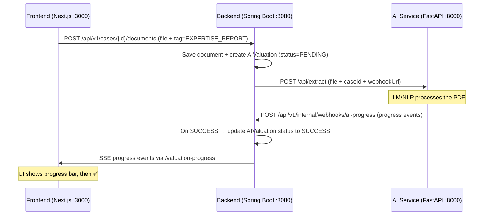

# AI Valuation Pipeline — How It Works

## Architecture Overview

Your project has **3 services** that must all be running for the AI pipeline to work:



## The 3 Services You Need Running

| Service | Directory | Command | Port |
|---------|-----------|---------|------|
| **Frontend** | `frontend/` | `npm run dev` | `:3000` |
| **Backend** | `backend/` | `./mvnw spring-boot:run` (or via IDE) | `:8080` |
| **AI Service** | `ai-service/` | `uvicorn app.main:app --host 0.0.0.0 --port 8000 --reload` | `:8000` |

## What Happens Step by Step

### 1. Document Upload
- You upload a PDF in the **SAISIE** phase with tag `EXPERTISE_REPORT`
- Backend saves the file and checks if AI extraction should trigger via [isExpertiseReportTrigger()](file:///c:/Users/IlhemBENYEDDER/Desktop/pfe/backend/src/main/java/com/leasrecover/modules/cases/DocumentUploadService.java#L222-L230)

### 2. AI Extraction Triggered
- Backend creates an `AIValuation` record with status `PENDING` 
- Backend sends the PDF to FastAPI at `http://localhost:8000/api/extract` asynchronously — see [triggerAiExtraction()](file:///c:/Users/IlhemBENYEDDER/Desktop/pfe/backend/src/main/java/com/leasrecover/modules/cases/DocumentUploadService.java#L232-L289)

### 3. FastAPI Processes & Calls Back
- The AI service processes the PDF (extracts brand, model, year, mileage, market value)
- It sends progress updates and final results back to the backend webhook: `POST http://localhost:8080/api/v1/internal/webhooks/ai-progress`

### 4. Backend Updates Status
- On `SUCCESS` callback → [processSuccessCallback()](file:///c:/Users/IlhemBENYEDDER/Desktop/pfe/backend/src/main/java/com/leasrecover/modules/cases/AIValuationService.java#L71-L235) updates `AIValuation.status` to `SUCCESS`
- On `FAILED` → status updated to `FAILED`

### 5. Phase Transition Gate
- [CasePrerequisiteService](file:///c:/Users/IlhemBENYEDDER/Desktop/pfe/backend/src/main/java/com/leasrecover/modules/cases/CasePrerequisiteService.java#L41-L48) checks for `ai_valuation` records with status `SUCCESS` or `COMPLETED`
- If none found → blocks SAISIE → VENTE transition

## Why You're Blocked

> [!IMPORTANT]
> The AI Service (FastAPI on port 8000) is likely **not running**. Without it:
> 1. The upload succeeds (document is saved) ✅
> 2. Backend tries to call `http://localhost:8000/api/extract` → **fails silently** (async, caught exception)
> 3. `AIValuation` stays in `PENDING` status forever
> 4. Phase transition check finds no `SUCCESS`/`COMPLETED` valuation → **blocks you**

## How to Fix

### Option A: Start the AI Service
```bash
cd ai-service
pip install -r requirements.txt
uvicorn app.main:app --host 0.0.0.0 --port 8000 --reload
```
Then re-upload the expertise report PDF.

### Option B: Use Docker Compose
```bash
docker-compose -f docker-compose.dev.yml up
```

### Option C: Manually update the DB (for testing only)
If you just want to unblock the phase transition without the AI service:
```sql
UPDATE ai_valuation SET status = 'SUCCESS', processed_at = NOW() WHERE case_id = '019f52e8-295a-7ff4-904b-e41f70191c4a' AND status = 'PENDING';
```
